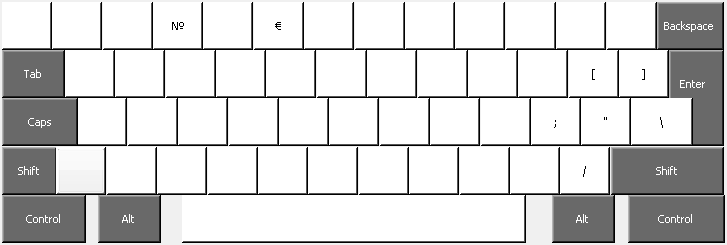
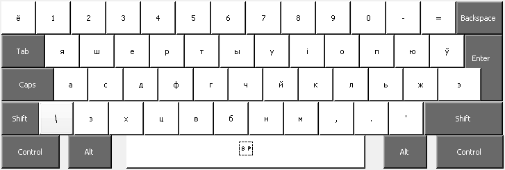
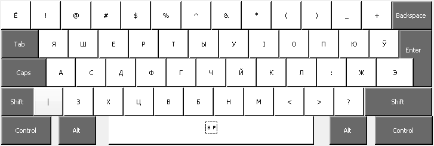

ru-phonet
=========

Russian Phonetic Keyboard Layout / Русская фонетическая раскладка клавиатуры

* [RuPhonet.zip](https://github.com/dmitskevich/ru-phonet/raw/master/RuPhonet.zip) (for Windows, requires Admin rights)
* [RuPhonet-portable.zip](https://github.com/dmitskevich/ru-phonet/raw/master/RuPhonet-portable.zip) (for Windows, based on [PKL](http://pkl.sourceforge.net/))
* [ru](https://github.com/dmitskevich/ru-phonet/raw/master/ru) (for Linux)

---

Мягкий (ь) и твёрдый (ъ) знаки присутствуют только в "строчном" виде:

Shift:

Alt Gr:

be-phonet
=========

Belarusian Phonetic Keyboard Layout / Беларуская фанэтычная раскладка клавіятуры

* [BePhonet.zip](https://github.com/dmitskevich/ru-phonet/raw/master/BePhonet.zip) (for Windows, requires Admin rights)
* [BePhonet-portable.zip](https://github.com/dmitskevich/ru-phonet/raw/master/BePhonet-portable.zip) (for Windows, based on [PKL](http://pkl.sourceforge.net/))
* [RuBePhonet-portable.zip](https://github.com/dmitskevich/ru-phonet/raw/master/RuBePhonet-portable.zip) (for Windows, based on [PKL](http://pkl.sourceforge.net/))

---

У кароткая (ў) знаходзіцца на месцы шча (щ) у рускай, а апостраф (') - на месцы цвёрдага знака (ъ):

Shift:

Alt Gr:

